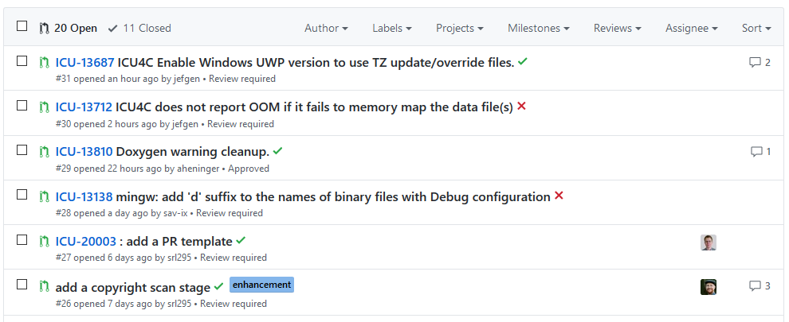

# GitHub Jira Linkifier Webextension

This is a WebExtension that automatically converts text containg Jira issues (like `ICU-1234`) into clickable links on GitHub.

## Authors

* Jeff Genovy
* See the list of [contributors](https://github.com/jefgen/github-jira-linkifier-webextension/contributors) who helped make this extension better. (Thank you!)

## License

This project is licensed under the MIT License - see the [LICENSE](LICENSE) file for details.
